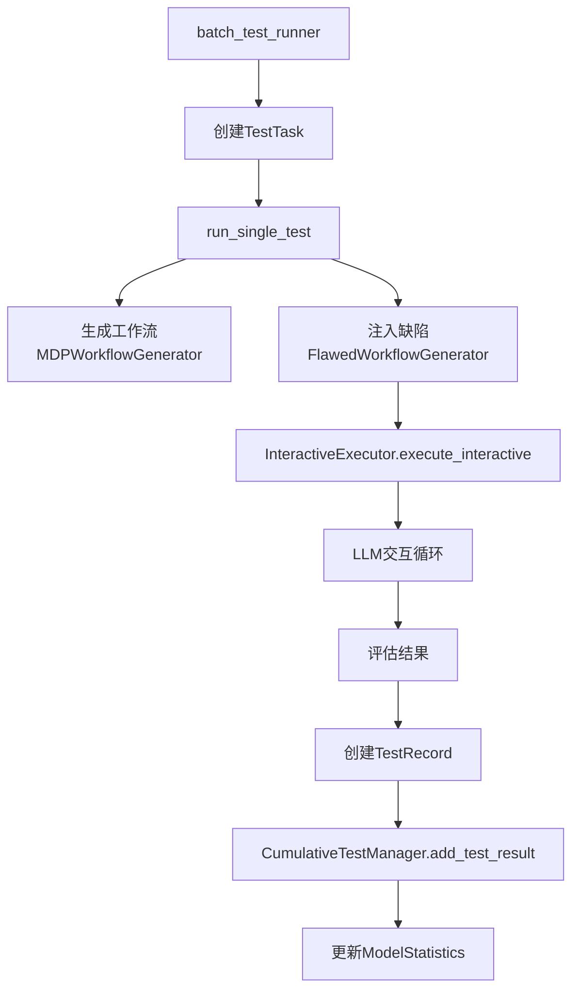

# 系统架构文档 (System Architecture)

## 📋 目录
1. [核心组件概览](#核心组件概览)
2. [数据流架构](#数据流架构)
3. [关键类和接口](#关键类和接口)
4. [统计系统架构](#统计系统架构)
5. [错误处理机制](#错误处理机制)

---

## 核心组件概览

### 1. 工作流生成层
```
mdp_workflow_generator.py
├── MDPWorkflowGenerator
│   ├── 属性:
│   │   ├── full_tool_registry (Dict) - 完整工具注册表
│   │   ├── tool_capabilities (Dict) - 工具能力字典
│   │   └── embedding_manager - 嵌入管理器
│   └── 方法:
│       ├── generate_workflow() - 生成工作流
│       └── get_sample_task() - 获取示例任务

flawed_workflow_generator.py
├── FlawedWorkflowGenerator
│   ├── 初始化参数:
│   │   ├── tool_registry=generator.tool_capabilities (注意!)
│   │   ├── embedding_manager=generator.embedding_manager
│   │   └── tool_capabilities=generator.tool_capabilities
│   └── 缺陷类型:
│       ├── sequence_disorder - 顺序错误
│       ├── tool_misuse - 工具误用
│       ├── parameter_error - 参数错误
│       ├── missing_step - 缺少步骤
│       ├── redundant_operations - 冗余操作
│       ├── logical_inconsistency - 逻辑不一致
│       └── semantic_drift - 语义偏移
```

### 2. 执行层
```
interactive_executor.py
├── InteractiveExecutor
│   ├── 初始化:
│   │   ├── tool_registry - 工具注册表
│   │   ├── max_turns=10 - 最大轮数
│   │   ├── success_rate - 工具成功率
│   │   └── model - 模型名称
│   ├── 核心方法:
│   │   ├── execute_interactive() - 交互式执行
│   │   ├── _get_llm_response() - 获取LLM响应（含重试）
│   │   └── _evaluate_success_detailed() - 评估成功级别
│   └── 状态管理:
│       └── ExecutionState - 执行状态对象
```

### 3. 测试运行层
```
batch_test_runner.py
├── TestTask (dataclass)
│   ├── model: str
│   ├── task_type: str
│   ├── prompt_type: str
│   ├── difficulty: str
│   ├── is_flawed: bool
│   ├── flaw_type: Optional[str]
│   ├── required_tools: Optional[List[str]]
│   └── tool_success_rate: float = 0.8

workflow_quality_test_flawed.py
├── WorkflowQualityTester
│   ├── 提示策略:
│   │   ├── baseline - 基线提示
│   │   ├── cot - 思维链提示
│   │   ├── optimal - 最优提示
│   │   └── flawed - 缺陷提示（特殊）
│   └── 缺陷测试原理:
│       └── 缺陷作为"提示策略"而非修改工作流对象
```

### 4. 数据管理层
```
cumulative_test_manager.py
├── CumulativeTestManager
│   ├── 数据库路径: pilot_bench_cumulative_results/master_database.json
│   └── add_test_result() - 添加测试结果

cumulative_data_structure.py
├── SuccessMetrics
│   ├── 原有统计（不受assisted影响）:
│   │   ├── total_tests - 总测试数
│   │   ├── full_success - 完全成功
│   │   ├── partial_success - 部分成功
│   │   └── failure - 失败
│   └── Assisted统计（额外的）:
│       ├── assisted_failure - 得到帮助但失败
│       ├── assisted_success - 得到帮助后成功
│       ├── total_assisted_turns - 总帮助轮数
│       └── tests_with_assistance - 获得帮助的测试数
```

---

## 数据流架构

### 1. 测试执行流程


### 2. 错误分类流程
```
错误发生 → _generate_intelligent_error_message() → 生成错误消息
                                                    ↓
                                        ErrorMetrics.categorize_error()
                                                    ↓
                                        分类到7种错误类型之一
```

### 3. Assisted统计流程
```
执行过程中 format_error_count > 0
            ↓
    记录为获得过帮助的测试
            ↓
    根据最终结果分类:
    - success → assisted_success
    - failure → assisted_failure
            ↓
    更新统计（不影响原有success/failure计数）
```

---

## 关键类和接口

### TestRecord 字段映射
```python
TestRecord → test_dict → ModelStatistics
━━━━━━━━━━━━━━━━━━━━━━━━━━━━━━━━━━━━━
必需字段:
- model                 → model
- task_type            → task_type  
- prompt_type          → prompt_type
- success              → success
- success_level        → success_level
- execution_status     → 用于_determine_success_level()

重要字段:
- format_error_count   → 帮助轮数统计
- executed_tools       → 工具覆盖率计算
- required_tools       → 任务要求的工具
- error_message        → 错误分类
- api_issues          → API层面问题（不计入工作流错误）

分数字段:
- workflow_score
- phase2_score
- quality_score
- final_score
```

### 成功级别判定
```python
success_level 可能值:
- "full_success"      # 完全成功
- "partial_success"   # 部分成功
- "failure"          # 失败
# 注：不再使用 "assisted_attempt"
```

---

## 统计系统架构

### 1. 统计层级
```
ModelStatistics (模型级)
├── overall_* (整体统计)
├── by_task_type (按任务类型)
├── by_prompt_type (按提示类型)
├── by_flaw_type (按缺陷类型)
├── by_difficulty (按难度)
└── by_tool_reliability (按工具可靠性)
```

### 2. 关键计算公式
```python
# 成功率（原有）
success_rate = (full_success + partial_success) / total_tests

# 加权成功分数
weighted_score = (full_success * 1.0 + partial_success * 0.5) / total_tests

# Assisted相关
avg_assisted_turns = total_assisted_turns / total_tests
assisted_success_rate = assisted_success / (assisted_success + assisted_failure)
assistance_rate = tests_with_assistance / total_tests

# 工具覆盖率
tool_coverage_rate = unique_tools_count / 120  # 120是总工具数
```

---

## 错误处理机制

### 1. API错误处理
```python
API错误类型（不计入工作流错误）:
- 400 Bad Request
- Rate Limit（限流）
- Connection Error

处理流程:
1. 重试机制（最多5次）
2. 指数退避（基础0.5-1.5秒，1.5^n增长）
3. 失败后记录到 api_issues
4. 不影响turn计数
```

### 2. 工作流错误分类（7种）
```python
1. tool_call_format_errors   # 工具调用格式错误
2. timeout_errors            # 超时错误
3. dependency_errors         # 依赖错误  
4. parameter_config_errors   # 参数配置错误
5. tool_selection_errors     # 工具选择错误
6. sequence_order_errors     # 序列顺序错误
7. max_turns_errors         # 最大轮数错误
```

---

## ⚠️ 重要注意事项

### 1. FlawedWorkflowGenerator 初始化
```python
# 正确 ✅
FlawedWorkflowGenerator(
    tool_registry=generator.tool_capabilities,  # 注意是tool_capabilities
    embedding_manager=generator.embedding_manager,
    tool_capabilities=generator.tool_capabilities
)

# 错误 ❌
FlawedWorkflowGenerator(
    tool_registry=generator.tool_registry,  # 错误！
    ...
)
```

### 2. 缺陷测试的prompt_type
```python
# 缺陷测试时
prompt_type = 'flawed'  # 不是 'baseline'
```

### 3. TestRecord的success_level字段
```python
# 需要同时设置两个字段（兼容性）
record.execution_status = result.get('success_level', 'failure')
record.success_level = result.get('success_level', 'failure')
```

### 4. 工具使用跟踪
```python
# 优先使用 executed_tools，回退到 tool_calls
tools_to_track = test_record.get('executed_tools', test_record.get('tool_calls', []))
```

---

**文档创建时间**: 2025-01-08
**最后更新**: 2025-01-08
**版本**: 1.0