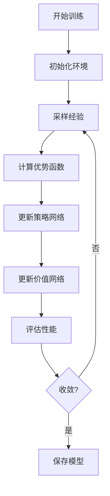

# WorkflowBench Scale-Up 系统架构文档

## 🏗️ 总体架构

WorkflowBench Scale-Up 采用分层模块化架构，基于马尔可夫决策过程(MDP)框架构建的智能工作流自动化系统。

```
┌─────────────────────────────────────────────────────────────┐
│                    应用层 (Application Layer)                │
├─────────────────────────────────────────────────────────────┤
│  工作流质量测试器  │  可视化分析器  │  交互式执行器  │  API管理器  │
└─────────────────────────────────────────────────────────────┘
┌─────────────────────────────────────────────────────────────┐
│                     核心层 (Core Layer)                      │
├─────────────────────────────────────────────────────────────┤
│     MDP框架      │   训练管理器   │  工作流生成器  │  缺陷生成器  │
└─────────────────────────────────────────────────────────────┘
┌─────────────────────────────────────────────────────────────┐
│                    服务层 (Service Layer)                    │
├─────────────────────────────────────────────────────────────┤
│  嵌入管理服务  │  工具能力管理  │  操作索引服务  │  推理生成器   │
└─────────────────────────────────────────────────────────────┘
┌─────────────────────────────────────────────────────────────┐
│                   基础设施层 (Infrastructure)                │
├─────────────────────────────────────────────────────────────┤
│   PyTorch    │    FAISS     │   OpenAI API  │   配置管理   │
└─────────────────────────────────────────────────────────────┘
```

## 🎯 核心组件详解

### 1. MDP框架层 (generalized_mdp_framework.py)

#### 1.1 状态空间设计

```python
@dataclass
class TaskState:
    task_id: str
    current_step: int
    tool_states: Dict[str, ToolExecutionStatus]
    workflow_context: Dict[str, Any]
    error_history: List[str]
    execution_trace: List[Dict]
    phase: int
    step_dependencies: Dict[str, List[str]]
```

**状态特征:**
- **任务标识**: 唯一任务ID和当前执行步骤
- **工具状态**: 每个工具的执行状态追踪
- **上下文信息**: 工作流执行上下文和依赖关系
- **错误追踪**: 历史错误记录和执行轨迹
- **阶段管理**: 多阶段执行状态管理

#### 1.2 动作空间定义

```python
class ActionType(Enum):
    INVOKE_TOOL = "invoke_tool"              # 调用工具
    VALIDATE_OUTPUT = "validate_output"      # 验证输出
    RETRY_TOOL = "retry_tool"               # 重试工具
    RECOVER_ERROR = "recover_error"         # 错误恢复
    CHECK_DEPENDENCIES = "check_dependencies" # 检查依赖
    CREATE_CHECKPOINT = "create_checkpoint"  # 创建检查点
    RESTORE_CHECKPOINT = "restore_checkpoint" # 恢复检查点
    PARALLEL_EXECUTE = "parallel_execute"    # 并行执行
    CONDITIONAL_BRANCH = "conditional_branch" # 条件分支
```

#### 1.3 奖励函数设计

```python
def calculate_reward(self, state: TaskState, action: MDPAction, 
                    next_state: TaskState, execution_result: Any) -> float:
    """
    多维度奖励计算:
    1. 执行成功奖励 (0-1)
    2. 效率奖励 (-0.1 per step)
    3. 质量奖励 (0-0.5)
    4. 错误惩罚 (-0.5 per error)
    """
```

### 2. 训练管理层 (unified_training_manager.py)

#### 2.1 架构设计

```python
class UnifiedTrainingManager:
    ├── PPOTrainer           # PPO算法实现
    ├── DQNTrainer          # DQN算法实现  
    ├── ReplayBuffer        # 经验回放缓冲区
    ├── PolicyNetwork       # 策略网络
    ├── ValueNetwork        # 价值网络
    └── TrainingConfig      # 训练配置管理
```

#### 2.2 网络架构

**策略网络 (PolicyNetwork):**
```python
class PolicyNetwork(nn.Module):
    def __init__(self, state_dim=512, action_dim=64, hidden_dim=256):
        self.encoder = nn.Sequential(
            nn.Linear(state_dim, hidden_dim),
            nn.ReLU(),
            nn.Dropout(0.1),
            nn.Linear(hidden_dim, hidden_dim),
            nn.ReLU(),
            nn.Linear(hidden_dim, action_dim)
        )
```

**价值网络 (ValueNetwork):**
```python
class ValueNetwork(nn.Module):
    def __init__(self, state_dim=512, hidden_dim=256):
        self.network = nn.Sequential(
            nn.Linear(state_dim, hidden_dim),
            nn.ReLU(),
            nn.Dropout(0.1),
            nn.Linear(hidden_dim, hidden_dim),
            nn.ReLU(),
            nn.Linear(hidden_dim, 1)
        )
```

#### 2.3 训练流程



### 3. 工作流生成层

#### 3.1 MDP工作流生成器 (mdp_workflow_generator.py)

```python
class MDPWorkflowGenerator:
    def generate_workflow(self, task_type: str, difficulty: str) -> Workflow:
        """
        工作流生成流程:
        1. 分析任务需求
        2. 选择合适工具
        3. 构建执行序列
        4. 优化依赖关系
        5. 验证工作流完整性
        """
```

**工作流类型:**
- `basic_task`: 单步骤基础任务
- `simple_task`: 2-3步骤简单任务  
- `data_pipeline`: 数据处理管道
- `api_integration`: API集成工作流
- `multi_stage_pipeline`: 多阶段复杂管道

#### 3.2 缺陷工作流生成器 (flawed_workflow_generator.py)

```python
class FlawedWorkflowGenerator:
    def inject_flaw(self, workflow: Workflow, flaw_type: str, 
                   severity: str) -> FlawedWorkflow:
        """
        缺陷注入策略:
        1. missing_middle: 删除关键中间步骤
        2. order_flaw_swap: 交换步骤顺序
        3. semantic_mismatch: 引入语义不一致
        """
```

**缺陷严重性级别:**
- **Light**: 轻微缺陷，不影响核心功能
- **Medium**: 中等缺陷，影响部分功能
- **Severe**: 严重缺陷，严重影响执行

### 4. 服务支撑层

#### 4.1 嵌入管理服务 (mcp_embedding_manager.py)

```python
class MCPEmbeddingManager:
    ├── VectorStore          # 向量存储 (FAISS)
    ├── EmbeddingGenerator   # 嵌入生成器
    ├── SearchEngine        # 语义搜索引擎
    └── CacheManager        # 缓存管理器
```

**功能特性:**
- 工具和任务的向量化表示
- 基于FAISS的高效相似度搜索
- 智能缓存机制优化性能
- 支持增量更新和批量索引

#### 4.2 工具能力管理 (tool_capability_manager.py)

```python
class ToolCapabilityManager:
    def __init__(self):
        self.tool_registry = {}      # 工具注册表
        self.capability_matrix = {}  # 能力矩阵
        self.dependency_graph = {}   # 依赖图
```

**核心功能:**
- 工具能力分析和分类
- 动态工具发现和注册
- 依赖关系管理
- 能力匹配和推荐

#### 4.3 操作索引服务 (operation_embedding_index.py)

```python
class OperationEmbeddingIndex:
    def build_index(self, operations: List[Operation]) -> FaissIndex:
        """
        操作索引构建:
        1. 操作特征提取
        2. 向量化编码
        3. 构建FAISS索引
        4. 优化搜索性能
        """
```

### 5. 执行与测试层

#### 5.1 交互式执行器 (interactive_executor.py)

```python
class InteractiveExecutor:
    async def execute_workflow(self, workflow: Workflow) -> ExecutionResult:
        """
        异步工作流执行:
        1. 解析工作流定义
        2. 调度任务执行
        3. 监控执行状态
        4. 处理异常和重试
        5. 生成执行报告
        """
```

#### 5.2 工作流质量测试器 (workflow_quality_test_flawed.py)

```python
class FlawedWorkflowTester:
    def run_comprehensive_test(self) -> TestResults:
        """
        综合测试流程:
        1. 生成测试用例
        2. 执行多策略测试
        3. 收集性能指标
        4. 分析缺陷影响
        5. 生成质量报告
        """
```

**测试策略:**
- **Baseline**: 基础提示策略
- **Optimal**: 优化提示策略
- **Chain-of-Thought**: 思维链提示策略

### 6. API与客户端管理 (api_client_manager.py)

```python
class APIClientManager:
    def __init__(self):
        self.openai_client = None
        self.azure_client = None
        self.rate_limiter = RateLimiter()
        self.retry_handler = RetryHandler()
```

**功能特性:**
- 统一API客户端管理
- 智能负载均衡和故障转移
- 请求限流和重试机制
- 成本优化和使用监控

## 🔄 数据流架构

### 训练数据流


### 推理数据流


## 🎛️ 配置管理架构

### 配置层次结构

```
config/
├── config.json                    # 主配置文件
├── ppo_m1_config.json            # PPO M1优化配置
├── ppo_m1_overnight_config.json  # 长时间训练配置
└── training_config.json          # 训练参数配置
```

### 配置参数说明

```json
{
  "api_config": {
    "use_azure_openai": true,
    "model": "gpt-4o-mini",
    "max_tokens": 2048,
    "temperature": 0.7
  },
  "training_config": {
    "algorithm": "ppo",
    "learning_rate": 0.0003,
    "batch_size": 64,
    "episodes": 1000,
    "gamma": 0.99,
    "tau": 0.95
  },
  "mdp_config": {
    "state_dim": 512,
    "action_dim": 64,
    "max_steps": 50,
    "reward_scale": 1.0
  }
}
```

## 📊 监控与可视化架构

### 监控指标体系

```python
class MetricsCollector:
    def collect_training_metrics(self):
        return {
            "episode_reward": [],
            "loss_policy": [],
            "loss_value": [],
            "success_rate": [],
            "execution_time": []
        }
    
    def collect_quality_metrics(self):
        return {
            "workflow_completeness": [],
            "flaw_detection_accuracy": [],
            "execution_efficiency": [],
            "error_recovery_rate": []
        }
```

### 可视化组件 (visualization_utils.py)

```python
class VisualizationUtils:
    def plot_training_curves(self)      # 训练曲线
    def plot_quality_analysis(self)     # 质量分析图
    def plot_flaw_sensitivity(self)     # 缺陷敏感性分析
    def generate_comparison_charts(self) # 对比图表
```

## 🔧 性能优化架构

### 计算优化

```python
# GPU/CPU混合计算
device = torch.device("cuda" if torch.cuda.is_available() else "cpu")

# 模型并行化
model = nn.DataParallel(model)

# 梯度累积
accumulate_grad_batches = 4

# 混合精度训练
scaler = torch.cuda.amp.GradScaler()
```

### 内存优化

```python
# 梯度检查点
torch.utils.checkpoint.checkpoint(model, input)

# 动态批处理
dynamic_batch_size = min(batch_size, available_memory // memory_per_sample)

# 缓存管理
@lru_cache(maxsize=1000)
def cached_embedding(text: str) -> np.ndarray:
    return embedding_model.encode(text)
```

## 🧪 测试架构

### 单元测试结构

```
tests/
├── test_mdp_framework.py          # MDP框架测试
├── test_training_manager.py       # 训练管理器测试
├── test_workflow_generator.py     # 工作流生成器测试
├── test_quality_tester.py         # 质量测试器测试
└── test_integration.py            # 集成测试
```

### 测试策略

1. **单元测试**: 测试各组件的核心功能
2. **集成测试**: 测试组件间的协作
3. **性能测试**: 测试系统性能和扩展性
4. **质量测试**: 测试工作流质量评估准确性

## 🔒 安全架构

### API安全

```python
class SecurityManager:
    def validate_api_key(self, key: str) -> bool:
        # API密钥验证
    
    def encrypt_sensitive_data(self, data: str) -> str:
        # 敏感数据加密
    
    def audit_api_usage(self, request: Dict) -> None:
        # API使用审计
```

### 数据安全

- **敏感信息脱敏**: 自动检测和脱敏敏感数据
- **访问控制**: 基于角色的访问控制
- **数据加密**: 传输和存储数据加密
- **审计日志**: 完整的操作审计日志

## 🚀 扩展性架构

### 模块化设计

```python
# 插件接口
class PluginInterface:
    def initialize(self) -> None: pass
    def execute(self, context: Dict) -> Any: pass
    def cleanup(self) -> None: pass

# 工具扩展接口
class ToolExtension:
    def register_tool(self, tool: Tool) -> None: pass
    def get_capabilities(self) -> List[str]: pass
```

### 分布式支持

```python
# 分布式训练
from torch.distributed import init_process_group
from torch.nn.parallel import DistributedDataParallel

# 任务调度
class DistributedScheduler:
    def schedule_task(self, task: Task, nodes: List[Node]) -> None: pass
    def balance_load(self, tasks: List[Task]) -> Dict[Node, List[Task]]: pass
```

---

*架构文档版本: v2.0*  
*最后更新: 2025-08-02*